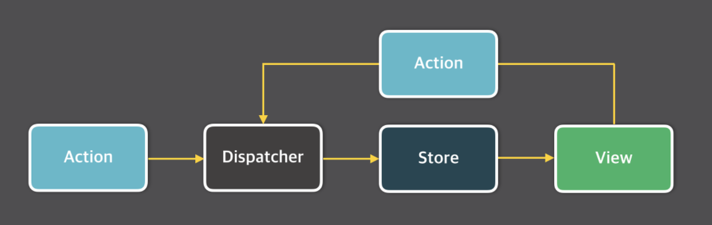

# make redux

- 어떤 코드가 상태를 어디서 바꾸나?

- props drilling을 해결하기위해 쓴다.

- 개별 컴포넌트는 외부와의 Dependency가 가능하면 없는것이 좋다.

## flux architecture

**one way binding. 데이터가 한 방향으로 흐른다.**

리액트에서 하나의 데이터에 여러 컴포넌트가 관심을 가질때

잘못 쓰거나 읽는 상황에서 어떻게 다룰 것인가에대한 해법.

1. `action -> dispatcher -> store -> view`

- 혈액형은 변하지 않으니까 혈액형, 데이터 이다.

- 기분은 변하니까 변하는 데이터로써 상태라고 부른다. 상태는 반드시 바뀐다.

- 바뀌는 것을 제어하는것이 `action`, `dispatcher` 이다.

그러나, ui로부터 상태가 바뀌는건 어떻게 처리하지? ⬇

2.

flux 아키텍처를 깔끔하게 구현한 redux 라이브러리.

각 컴포넌트에서 필요없는 데이터를 없앨 수 있다.
